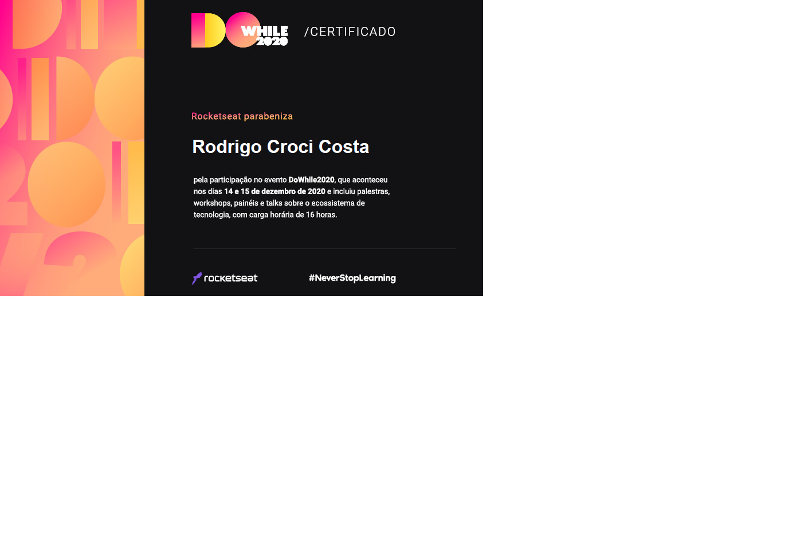

<h1 align="center">
  
 🚀 Metodologias 

</h1>

 

<h1 align="center">
  
</h1>

 

<h1 align="center">
  
 🚀 Dev Web .NET 

</h1>

 

<h1 align="center">
  
</h1>

<h1 align="center">
  
</h1>

<h1 align="center">
  
</h1>

 

<h1 align="center">
  
 🚀 Dev Web SPA 

</h1>

 

<!-- <h1 align="center">
  
</h1>

<h1 align="center">
  
</h1> -->

<h1 align="center">
  
</h1>

<h1 align="center">
  
</h1>

